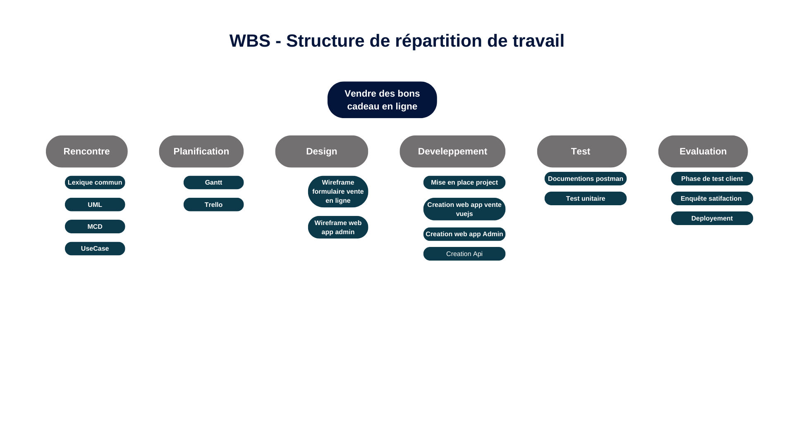

# mybizness

## Phase de Rencontre 
### Lexique Commun :
- **Admin** = utilisateur qui a les qualités requises pour les tâches d'administration
- **Staff** = utilisateur qui  veille au bon fonctionnement de l'appli mais n'a pas un rôle d'encadrement.
- **Client** = Utilisateur qui souhaite acheté un service ou un bien du CFG
- **CFG** = Circuit Felix guichard
- **Bénéficiaire** = Utilisateur qui va benéficier d'un bon cadeau offert par un client 
- **Bon Cadeau** => document physique ou virtual avec une date de validité, un identifiant, un style, eventuellement un message et il nome un bénéficiaire et permet de profiter d'un ou des produits du CFG définie sur le bon sans nécessité de paiement
- **CRUD** => Créer Afficher Modifier Supprimer 
- **Activité** => Représente une catégorie de produits proposé au CFG
-**Produit** => Représente un bien ou un service d'une activité en vente au circuit.
-**Theme** => le thème désigne l'apparence graphique, c'est-à-dire la présentation à l'affichage du bon cadeau et il designe aussi à quel occasion le bon kdo est offert
- **Date de validité** => il s'agit d'une date limite d'utilisation pour un bénéficiaire d'un bon kdo (elle peut être repoussé sur demandes et par un admin)
- **identifiant** => n° unique permettant d'identifier un bon Cadeau
- **paiement** => Action de payer, de régler un achat, de donner une somme d'argent contre un bien ou un service.
- **facture** => Document comptable établit sur vosfactures.fr justifiant du paiement réussi d'un client. Le document peut être imprimé ou envoyer par mail.
- **vosfactures** => application web utilisé par le CFG, permettant de gerer l'activité commercial

### UML:
#### Vendre des bons cadeaux en ligne:
**Qui ?**
un Client qui souhaiute acheté un bon de cadeau(x) pour un bénéficaire 
**Quoi ?**
Vendre des bons de cadeau(x) en ligne
**Ou ?**
En ligne via un formulaire de vente vosfactures connecté au site web
**Quand ?**
24h/24h et 7jrs sur 7
**Comment ?**
Réaliser un formulaire de vente en ligne permettant  d'afficher le catalogue pour le client , d'entrer ces informations , celui du bénéficaire, choisir un theme, choisir les cadeau qu'il souhaite offrir, payer sa commande et recevoir son justificatif de payement et son bon cadeau.
Réaliser une api permettant de transmettre les information au formulaire pour la vente en ligne et générer de façon sécurisé la création d'un nouveau bon.
Realiser une interface Staff / admin pour gérer la gestion des produits, suivre les commande et gérer les thèmes et paramatre de l'application
**Combien ?**
Le prix du bon est variable en fonction des produits ajoutés
Améliorer la vente de bons cadeaux de 30%
**Pourquoi ?**
Pour faciliter l'accés et la vente de bon cadeau
Eliminée le temps perdu à la création
Augmenter les ventes
Libérer du temps au personnel
Diminuer la Perte d'argent

